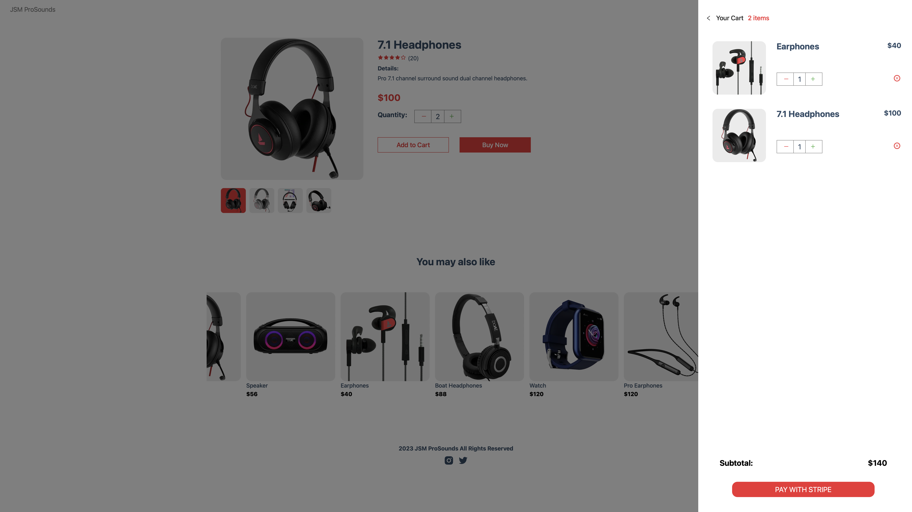
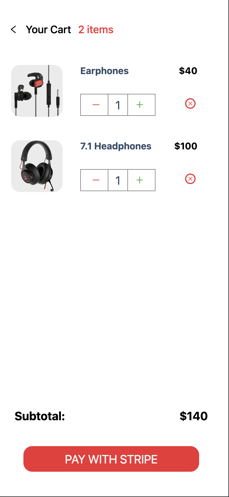
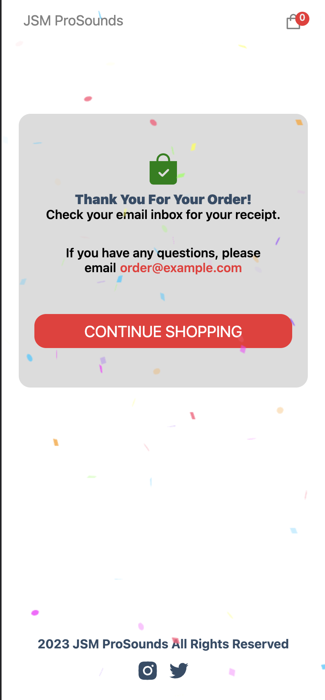

# JSM ProSounds 

#### JSM ProSounds is a fully responsive, modern full stack e-commerce application built with React, Next.JS, Stripe & Sanity

Use the app [here](https://e-com-app-sanity.vercel.app)

# Description
JSM ProSounds is a fully responsive and modern full stack app with all the functionality of an e-commerce app. The user can browse the products, add and remove products to and from the cart, review and modify the cart, and finally pay securely using the fully integrated Stripe payment processing interface. 

 
# Take a Look at the App

## Desktop:

<kbd>

</kbd>

## Mobile:

<kbd>

</kbd>

<kbd>

</kbd>

<kbd>

</kbd>

<kbd>

</kbd>

# Tools Used

### Development Environment
* Node.js

### Libraries & Frameworks
* React 
* Next.JS

### Payment Processing
* Stripe

### Content Management System (CMS)
* Sanity

### Hosting 
* Vercel

# Features

### Users are able to:

* browse all products
* see product details
* add profucts to the cart
* remove products from the cart
* review the cart
* modify the cart
* choose appropriate shipping costs
* pay securely 

</body>
